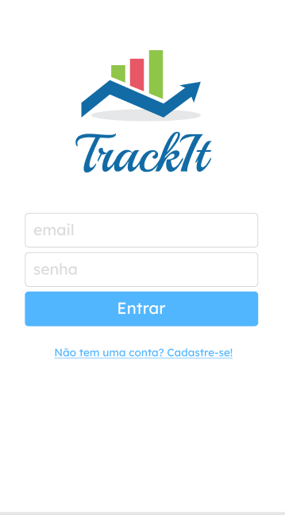

<h2  align="center">



</h2>


<p  align="center">

<a  href="#-projeto">Projeto</a>&nbsp;&nbsp;&nbsp;|&nbsp;&nbsp;&nbsp;

<a  href="#-tecnologias">Tecnologias</a>&nbsp;&nbsp;&nbsp;|&nbsp;&nbsp;&nbsp;

<a  href="#-scripts">Scripts</a>&nbsp;&nbsp;&nbsp;|&nbsp;&nbsp;&nbsp;

<a  href="#-licença">Licença</a>

</p>

  
## 💻 Projeto


Este projeto é uma aplicação em REACTJS com integracao a API de listagem e criacao de hábitos, para estilização foi utilizado Styled-Components e React Icons para adicionar os Icones.


## 🧪 Tecnologias


O projeto foi desenvolvido usando as seguintes tecnologias:
  

- [React](https://reactjs.org)
- [Next.js](https://nextjs.org)
- [Styled-Components](https://styled-components.com/)
- [React-Icons](https://react-icons.github.io/react-icons/)


## 📝 Scripts

Instale as dependências.

  

```bash
$ yarn
```

  

Para executar o projeto rode o comando abaixo.

```bash
$ yarn start
```
ou
```bash
$ npm run start
```
  
  

Para realizar o build basta executar o comando abaixo que com o package do next será feito o build.

  
```bash
$ yarn build
```


## 📝 Licença

  

This project is licensed under the MIT License. See the [LICENSE](LICENSE.md) file for details.

  

---
<p  align="center">Made with 💜 by <a  href="https://github.com/sararchh"  target="_blank">Sara Rocha</a></p>